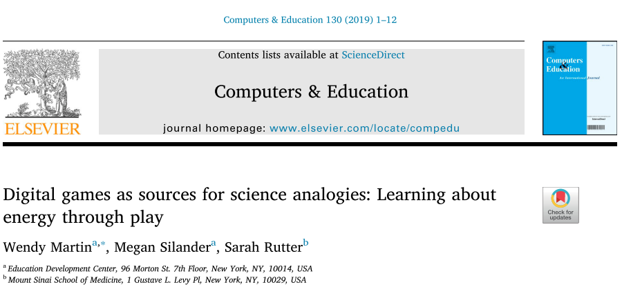

# Paper Review

[Paper Source](https://www.sciencedirect.com/science/article/pii/S0360131518302999)

## Paper Structure
* Introduction
    * Theoretical Framework
    * Research Question
* Methods
    * Intervention
    * Sample
    * Measures
        * Treatment
        * Outcomes
        * Student characteristics 
        * Teacher characteristics
        * Classroom and school characteristics
    * Analyses
        * Missing Data
* Findings
    * Implementation
    * Result
        * Sensitivity analysis
* Discussion
* Funding
* Reference

## Introduction
### Theoretical Framework
Educational researcher and developer have long seen the potential of digital game for creating a learning experiences that encourage students to learning a subject with enthusiasm like when they learn how to play a commercial digital game. However, for the knowledge that students received from the digital game to be converted into a real world knowldege, they need a skillful interpreter that translate what they get from game to real world knowledge. These "translation process" enable teacher to take advantage the implicit learning that happens when player engage with rules and  challenge inside the game so students to have explicit understanding about what they learn.

Analogy are a common strategy for develop new knowledge in learning science. By using analogy can help students can creating new knowledge by using their prior knowledge. Analogy can effectively help student understand concept that hard to grasp by connecting concept they understand to subject they currently learn in the classroom.

Digital games is a powerful source of analogies, because they can be designed systematically according to subject the students currently learn. By using digital games in classroom and the whole class play before instruction, ensure the class have same knowledge and undestanding from the same analogy source to be used to build a new knowledge.

Researchers have identified the specific ways to allow teacher use analogy for effective teaching method. The connection from the source and target must not limited to only surface level similarities, rather they must also show similarities on relationship,structures or processess.

In this study, a pedagogical approach called analogy mapping are explored. The use of digital games can be particulary useful in this process called analogy mapping because digital games contain lot of image and action that will be remembered and maybe discussed by teacher and students after the gameplay over.

### Research Question
Do students who play digital science games and then engage in discussions that map analogies from the games to the concepts they address demonstrate greater understanding of those concepts than students who play the games but do not engage in those discussions?

## Methods

## Findings

## Discussion

## Funding

