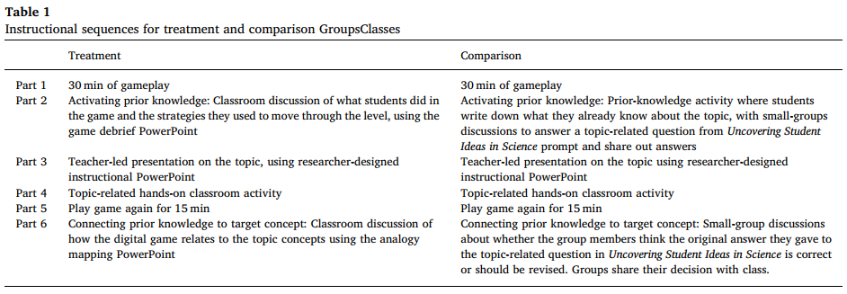

# Paper Review

[Paper Source](https://www.sciencedirect.com/science/article/pii/S0360131518302999)

## Paper Structure
* Introduction
    * Theoretical Framework
    * Research Question
* Methods
    * Intervention
    * Sample
    * Measures
        * Treatment
        * Outcomes
        * Student characteristics 
        * Teacher characteristics
        * Classroom and school characteristics
    * Analyses
        * Missing Data
* Findings
    * Implementation
    * Result
        * Sensitivity analysis
* Discussion
* Funding
* Reference

## Introduction
### Theoretical Framework
Educational researcher and developer have long seen the potential of digital game for creating a learning experiences that encourage students to learning a subject with enthusiasm like when they learn how to play a commercial digital game. However, for the knowledge that students received from the digital game to be converted into a real world knowldege, they need a skillful interpreter that translate what they get from game to real world knowledge. These "translation process" enable teacher to take advantage the implicit learning that happens when player engage with rules and  challenge inside the game so students to have explicit understanding about what they learn.

Analogy are a common strategy for develop new knowledge in learning science. By using analogy can help students can creating new knowledge by using their prior knowledge. Analogy can effectively help student understand concept that hard to grasp by connecting concept they understand to subject they currently learn in the classroom.

Digital games is a powerful source of analogies, because they can be designed systematically according to subject the students currently learn. By using digital games in classroom and the whole class play before instruction, ensure the class have same knowledge and undestanding from the same analogy source to be used to build a new knowledge.

Researchers have identified the specific ways to allow teacher use analogy for effective teaching method. The connection from the source and target must not limited to only surface level similarities, rather they must also show similarities on relationship,structures or processess.

In this study, a pedagogical approach called analogy mapping are explored. The use of digital games can be particulary useful in this process called analogy mapping because digital games contain lot of image and action that will be remembered and maybe discussed by teacher and students after the gameplay over.

### Research Question
Do students who play digital science games and then engage in discussions that map analogies from the games to the concepts they address demonstrate greater understanding of those concepts than students who play the games but do not engage in those discussions?

## Methods
In this research they created instructional sequences on topics included in the Next Generation Science Standards for middle-school science—photosynthesis, heat transfer, and electricity—that address the crosscutting concept of energy transfer. Each of the sequences included a digital game based on the one of the three topics. Each game was designed to have images and actions that are analogous to the target science concepts.
In this study, they also designed treatment and comparison interventions that were very similar, except that the treatment condition used analogy mapping techniques while the comparison condition used an alternate set of instructional techniques.

The study sample consisted of 11 middle-grade science teachers from three low-income urban school districts in the Northeast United States and 231 of their sixth and seventh-grade students. One goal of this study was to develop and test an intervention that would be usable and that would improve learning for underserved students in low-income schools.

## Findings
The results suggest that teachers and students in the treatment group made six times as many references to analogies during instruction as did students and teachers in the comparison group. Treatment teachers made references to analogies a mean of 40.8 times across the three analogy mapping classes, compared to a mean of 7.0 times in comparison classrooms.

Most (72.2%) of the treatment teachers’ analogy references focused on the digital games and their relationship with the target concepts. In contrast, the comparison teachers and students more commonly used other sources for their analogies, mostly from outside the domain of science, while just 22.9% of their references to analogies related to the digital games.

The results suggest that students in the treatment group learned more than did those in the comparison group, as evidenced by multiple-choice
assessments. Specifcally, students in the treatment group learned more energy and electricity concepts.

## Discussion
Researcher who studied the use of digital games for educational have found that game can be a effective tool for support students learning.
But researcher who focus on the use of digital games in real world have observed that teacher need strategies to fully use the benefit of using game as tool for support students learning. Although indeed games can provide enganging experience, positive learning comes rely from good instructions and good instructions come from how much the teacher understand the game.

Though many studies focuses more on game design when designing digital games for education, studies that looked on teacher's practice found that student have positive outcomes when teacher use "bridging activities", in which teacher have discussion about the game and have deep understanding about the digital game they use.

Similarly this study also found that students whose teacher use bridging activities while playing digital game show more positive outcomes compared to the students play the similar digital game but the teacher did not do bridging activities. The finding from this study suggest that using instructional techniques holds promise as an approach to integrating digital games into instructions.

The limitations of this study is particulary the small sample size, self-selection into the study and lack of randomized assignemnt prevent them from making any causal claims about the techniques.